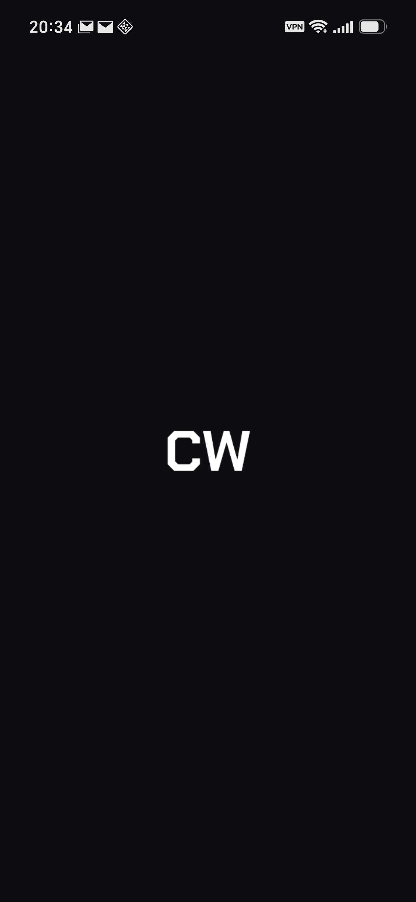
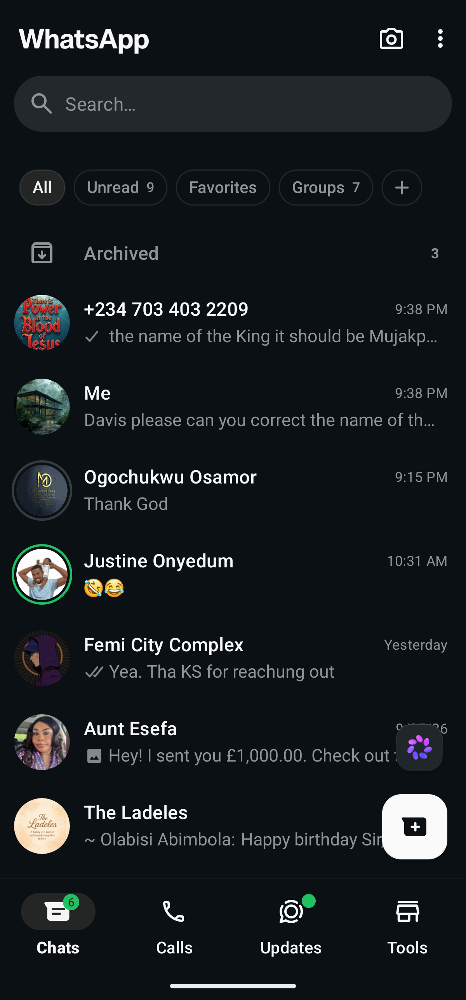
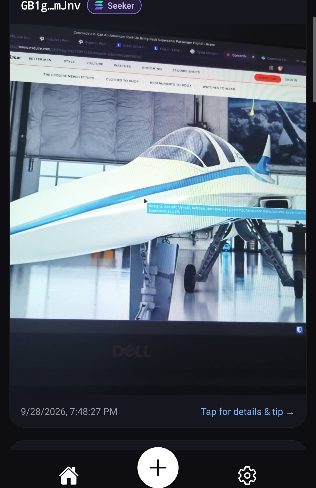
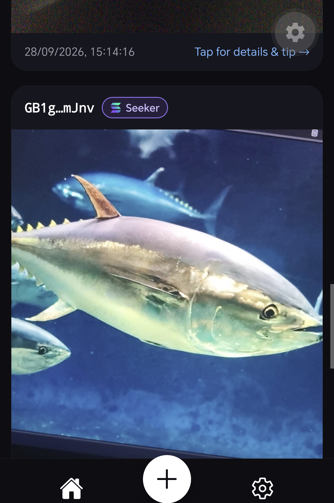

<div align="center">


# ChainWitness

**Hardware-signed authenticity in a world of AI-generated content.**

[](https://github.com/dpa9210/chainwitness/releases/latest/download/ChainWitness.apk)
[](https://youtu.be/IoPNh3jJsSQ)

Built for the **Solana Mobile Hackathon** · Solana Devnet · Android 7.0+

</div>

---

## What it is

Anyone can generate a photorealistic fake in seconds now. Metadata is
invisible to viewers and gets stripped by almost every app a photo passes
through. There's no simple way for a viewer to check whether a photo is
what it claims to be.

ChainWitness answers that narrowly, not with a bigger claim than it can
back up: every photo is captured **in-app only** (no gallery uploads), hashed
on the device, and the hash + timestamp is signed **and sent on-chain by the
user's own wallet** — a real Solana transaction, published within seconds of
the shutter closing. A backend independently re-verifies that transaction
against devnet before the post ever reaches the feed. No backend ever holds
a signing key; if every server we run vanished tomorrow, every proof already
on-chain would still check out on its own.

**What this proves:** the hash matches the exact bytes captured, that
wallet's key signed it, and the signature landed on-chain at that timestamp.
**What it doesn't claim:** that the camera wasn't pointed at a screen, or
that the scene wasn't staged. We don't use the word "unfakeable."

A full pitch deck (problem, mechanism, honesty about limits, roadmap) is
linked at the bottom.

## Screenshots

<table>
<tr>
<td></td>
<td></td>
<td></td>
<td></td>
</tr>
<tr>
<td align="center"><sub>Splash</sub></td>
<td align="center"><sub>First-run onboarding</sub></td>
<td align="center"><sub>Feed — Solana Seeker</sub></td>
<td align="center"><sub>Same feed — Android</sub></td>
</tr>
</table>

The Seeker Genesis Token badge (visible above, top-right of the author row)
is checked server-side against the real Token-2022 mint on mainnet — not a
client-reported flag.

## Features

- **In-app capture only** — no gallery picker, so the timestamp can't be
  backdated.
- **On-chain proof** — SHA-256 hash + timestamp published as a Solana Memo
  transaction, signed and sent by the user's own wallet via **Mobile Wallet
  Adapter** (Seed Vault-backed on Seeker, when the connected wallet uses it).
- **Independent backend re-verification** — the feed backend never trusts
  the client; it re-checks every transaction against devnet itself before
  storing anything.
- **Feed** — open to browse without a wallet; connecting one is only needed
  to post or tip.
- **Tipping** — send SOL straight to a post's author, wallet to wallet, no
  middleman.
- **Seeker Genesis Token badge** — shown on posts from wallets holding a
  real SGT, checked against mainnet.
- **Consecutive-day streak** — computed from the wallet's own on-chain
  posting history.
- **Daily local reminder** — an on-device notification, no server involved,
  that opens straight to the camera.
- **Capture controls** — pinch-to-zoom, flash toggle, front/back camera
  flip, haptic feedback throughout.
- **Light/dark theme**, first-run onboarding, and friendly (not raw) error
  messages everywhere a wallet or network call can fail.

## Download & install

1. Download **[ChainWitness.apk](https://github.com/dpa9210/chainwitness/releases/latest/download/ChainWitness.apk)**
   directly on the Android phone you'll test with (the link always points to
   the latest release).
2. Open the downloaded file. Android will prompt to allow installs from this
   source the first time — this is a self-signed hackathon build, not from
   the Play Store, so that prompt is expected.
3. Install an MWA-compatible wallet app if you don't already have one —
   [Phantom](https://play.google.com/store/apps/details?id=app.phantom) or
   [Solflare](https://play.google.com/store/apps/details?id=com.solflare.mobile)
   both work.
4. **Set that wallet app to Devnet** (its own network setting, separate from
   ChainWitness — this trips people up, see below) and get a little devnet
   SOL into it.
5. Open ChainWitness → Settings → **Connect Wallet**. Use the **Get Devnet
   SOL** button there if you need funds (or use Settings → airdrop from the
   wallet app itself).
6. Tap **+** to capture your first proof.

> **Why devnet:** the whole point of this submission is a real, checkable
> on-chain transaction — devnet gives that without spending real SOL to
> demo it. The architecture doesn't assume devnet anywhere; pointing it at
> mainnet is a config change, not a rewrite.

> **Common snag:** ChainWitness itself only ever talks to devnet. If posting
> or tipping fails with a network-mismatch error, it's almost always the
> *wallet app's own* separate network setting still on mainnet — check that
> first.

## Architecture

```
┌─────────────────────────────────────────────────────────────────┐
│  Android app (Expo / React Native)                                │
│  ├─ In-app camera → SHA-256 hash, computed on-device               │
│  ├─ Mobile Wallet Adapter → wallet signs AND sends the Memo tx      │
│  │  directly to Solana Devnet — no backend key, no relay            │
│  └─ Feed, tipping, streak, badges, daily reminder, haptics          │
└──────────────────────────┬──────────────────────────────────────┘
                            │ upload photo + metadata (feed only,
                            │ never the proof itself)
                            ▼
┌─────────────────────────────────────────────────────────────────┐
│  Backend (Next.js on Vercel)                                      │
│  ├─ POST /api/posts → independently re-verifies the tx against      │
│  │  devnet before storing anything; checks the author's wallet      │
│  │  for a Seeker Genesis Token on mainnet (non-fatal, best-effort)  │
│  └─ GET  /api/feed  → recent posts, newest first                    │
│  Storage: Vercel Blob (photos) + Upstash Redis (post metadata)      │
└──────────────────────────┬──────────────────────────────────────┘
                            ▼
┌─────────────────────────────────────────────────────────────────┐
│  Solana Devnet — publicly checkable by anyone via getTransaction,   │
│  independent of this backend or app                                │
└─────────────────────────────────────────────────────────────────┘
```

## Tech stack

- **App**: Expo / React Native, TypeScript, Expo Router, Expo Camera,
  `@solana-mobile/mobile-wallet-adapter-protocol`, `@solana/web3.js`,
  React Native Reanimated, Expo Notifications, Expo Haptics
- **Backend**: Next.js on Vercel, `@solana/web3.js` (server-side
  verification), Vercel Blob, Upstash Redis
- **On-chain**: Solana Devnet, SPL Memo program
  (`MemoSq4gqABAXKb96qnH8TysNcWxMyWCqXgDLGmfcHr`)

## Repo layout

```
app/       React Native / Expo mobile app
server/    Next.js backend (feed API, devnet re-verification)
PLAN.md    Full build log — day-by-day decisions, bugs found and fixed,
           verified-on-device notes, everything not obvious from the code
```

## Running it locally

**App:**
```bash
cd app
npm install
npx expo run:android   # needs an Android device/emulator attached
```

**Backend:**
```bash
cd server
npm install
vercel env pull .env.local
npm run dev
```

See `server/README.md` for backend infrastructure details (Blob store,
Redis, deployment) and `PLAN.md` for the complete build history.

## Links

- **Demo video**: https://youtu.be/IoPNh3jJsSQ
- **Pitch deck**: https://dpa9210.github.io/chainwitness/pitch-deck.html
- **Live backend**: https://chainwitness-api.vercel.app
- **Latest APK**: https://github.com/dpa9210/chainwitness/releases/latest/download/ChainWitness.apk

---

<div align="center"><sub>Solana Mobile Hackathon 2026</sub></div>
